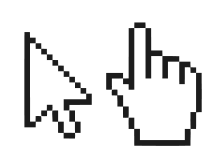

# Becoming dangerous in JS + HTML + CSS

> "A little knowledge is a dangerous thing." — Alexander Pope

Let's make a game called Lights Out, while learning the bare essentials of JS + HTML + CSS.
I assume you’ve already taken [Codecademy’s JavaScript course](https://www.codecademy.com/learn/javascript).

These lecture notes are just notes; they are intended to be accompanied with in-person instruction.

My approach in these lectures is to throw you in the deep end, and show you just enough
to keep your head above water. In that spirit: your first task is to [learn the game Lights Out](https://mikegagnon.github.io/lights-out/).

# PART 1. HTML and CSS

# Lecture 1. Intro to HTML

HTML is a "markup" language — which means you markup plain text with HTML tags.

## Example 1: Italics and Bold

```html
<i>This text is italicized</i>
<b>This text is bolded</b>
```

See the [result](https://mikegagnon.github.io/lights-out/lecture01/example01.html).

## <a name="ptag">Example 2: Paragraphs</a>

You can use the `<p>` tag to put text in separate paragraphs.

```html
<p>
  <i>This text is italicized</i>
</p>

<p>
  <b>This text is bolded</b>
</p>
```

See the [result](https://mikegagnon.github.io/lights-out/lecture01/example02.html).

## Example 3: Lists

You can use the `<ul>` and `<li>` tags to create a list.

```html
<ul>
  <li><i>This text is italicized</i></li>
  <li><b>This text is bolded</b></li>
</ul>
```

See the [result](https://mikegagnon.github.io/lights-out/lecture01/example03.html).

## Example 4: Proper HTML

A proper HTML file looks like this:

```html
<!DOCTYPE html>
<html>
  <head>
    <title>Lights Out</title>
  </head>
  <body>
    <ul>
      <li><i>This text is italicized</i></li>
      <li><b>This text is bolded</b></li>
    </ul>
  </body>
</html>
```

See the [result](https://mikegagnon.github.io/lights-out/lecture01/example04.html).

- The content inside the `<head>` tag doesn't get displayed
- The `<title>` tag may only appear inside the `<head>` tag. The text inside the `<title>` tag is displayed on the tab in your browser.
- The `<body>` tag stores everything that should be displayed

# Lecture 2. Intro to CSS

CSS lets you *style* HTML.

## Example 1: style

For instance, you can use CSS to change the background color of an HTML element.

```html
<ul>
  <li style="background: pink"><i>This text is italicized</i></li>
  <li style="background: grey"><b>This text is bolded</b></li>
</ul>
```

See the [result](https://mikegagnon.github.io/lights-out/lecture02/example01.html).

## <a name="foobar">Example 2: .css file</a>

There are several ways to sprinkle CSS on your HTML.

One of the ways is using `style="..."` inside an HTML tag (as in Example 1).

The most canonical way is to put your CSS definitions in a `.css` file,
then import that `.css` file into your HTML file.

For example, create a new file named `style.css` and add the following into that file.

```css
.foo {
    background: pink;
}

.bar {
    background: grey;
}
```

This creates two CSS "classes": class `foo` and class `bar`.

Now create a file named `index.html`:

```html
<!DOCTYPE html>
<html>
  <head>
    <title>Lights Out</title>
    <link rel="stylesheet" type="text/css" href="style.css">
  </head>
  <body>
    <ul>
      <li class="foo"><i>This text is italicized</i></li>
      <li class="bar"><b>This text is bolded</b></li>
    </ul>
  </body>
</html>
```

Notice the following lines:

* `<link rel="stylesheet" type="text/css" href="example02-style.css">`
* `<li class="foo"><i>This text is italicized</i></li>`
* `<li class="bar"><b>This text is bolded</b></li>`

This `<link ...>` tag imports the file `style.css` into the HTML file.

The `<li class="...">` tags attach CSS classes to HTML tags.

See the [result](https://mikegagnon.github.io/lights-out/lecture02/example02.html).

# Lecture 3. The \<div> tag

The `<div>` tag is a special HTML tag.

## Example 1: Like the \<p> tag

The `<div>` tag acts kind of like the paragraph tag (see [Lecture 1, Example 2](#ptag)).

```html
<div>First div</div>
<div>Second div</div>
```

See the [result](https://mikegagnon.github.io/lights-out/lecture03/example01.html).

## <a name="lecture3-example2">Example 2: Styling \<div> tags</a>

`<div>` tags are only interesting if you style them with CSS.

This example, and the next few examples, demonstrate the CSS you'll need to know
for making the Lights Out game.

First, we'll style some `<divs>` like [Lecture 2, Example 2](#foobar).

### `style.css`

```css
.foo {
    background: pink;
}

.bar {
    background: grey;
}
```

### `index.html`

```html
<!DOCTYPE html>
<html>
  <head>
    <title>Lights Out</title>
    <link rel="stylesheet" type="text/css" href="style.css">
  </head>
  <body>
    <div class="foo">First div</div>
    <div class="bar">Second div</div>
  </body>
</html>
```

See the [result](https://mikegagnon.github.io/lights-out/lecture03/example02.html).

## Example 3: Height and width

You can set the height and width of a `<div>` tag using CSS as follows:

### `style.css`

```css
.foo {
    background: pink;
    height: 100px;
    width: 100px;
}

.bar {
    background: grey;
    height: 100px;
    width: 100px;
}
```

The `px` suffix indicates that the unit of measurement is pixels.

### `index.html`

Just use the same `index.html` file from [Lecture 3, Example 2](#lecture3-example2)

See the [result](https://mikegagnon.github.io/lights-out/lecture03/example03.html).

## Example 4: Float left

You can use the `float` property in CSS to place `<div>` elements left-to-right.

### `style.css`

```css
.foo {
    background: pink;
    height: 100px;
    width: 100px;
    float: left;
}

.bar {
    background: grey;
    height: 100px;
    width: 100px;
    float: left;
}
```

### `index.html`

Use the same `index.html` file from [Lecture 3, Example 2](#lecture3-example2)

See the [result](https://mikegagnon.github.io/lights-out/lecture03/example04.html).

## <a name="lec3ex5">Example 5: Margin left</a>

To add horizontal white space between `<div>` elements, use the `margin-left` CSS property:

### `style.css`

```css
.foo {
    background: pink;
    height: 100px;
    width: 100px;
    float: left;
    margin-left: 5px;
}

.bar {
    background: grey;
    height: 100px;
    width: 100px;
    float: left;
    margin-left: 5px;
}
```

### `index.html`

Use the same `index.html` file from [Lecture 3, Example 2](#lecture3-example2)

See the [result](https://mikegagnon.github.io/lights-out/lecture03/example05.html).

## Example 6: Text align center

To *horizontally* center text within a `<div>` element, use the `text-align` CSS property.

### `style.css`

```css
.foo {
    background: pink;
    height: 100px;
    width: 100px;
    float: left;
    margin-left: 5px;
    text-align: center;
}

.bar {
    background: grey;
    height: 100px;
    width: 100px;
    float: left;
    margin-left: 5px;
    text-align: center;
}
```

### `index.html`

Use the same `index.html` file from [Lecture 3, Example 2](#lecture3-example2)

See the [result](https://mikegagnon.github.io/lights-out/lecture03/example06.html).

## Example 7: Vertical centering

To *vertically* center text within a `<div>` element, use the `line-height` CSS property.

Set the `line-height` property equal to the `height` property; in this case, `100px`.

### `style.css`

```css
.foo {
    background: pink;
    height: 100px;
    width: 100px;
    float: left;
    margin-left: 5px;
    text-align: center;
    line-height: 100px;
}

.bar {
    background: grey;
    height: 100px;
    width: 100px;
    float: left;
    margin-left: 5px;
    text-align: center;
    line-height: 100px;
}
```

### `index.html`

Use the same `index.html` file from [Lecture 3, Example 2](#lecture3-example2)

See the [result](https://mikegagnon.github.io/lights-out/lecture03/example07.html).

## <a name="lec3ex8">Example 8: Font</a>

To set the font within a `<div>` element, use the `font-family` CSS property.

In this case, set the `font-family` property equal to `Helvetica`.

### `style.css`

```css
.foo {
    background: pink;
    height: 100px;
    width: 100px;
    float: left;
    margin-left: 5px;
    text-align: center;
    line-height: 100px;
    font-family: Helvetica;
}

.bar {
    background: grey;
    height: 100px;
    width: 100px;
    float: left;
    margin-left: 5px;
    text-align: center;
    line-height: 100px;
    font-family: Helvetica;
}
```

### `index.html`

Use the same `index.html` file from [Lecture 3, Example 2](#lecture3-example2)

See the [result](https://mikegagnon.github.io/lights-out/lecture03/example08.html).

# Lecture 4

In this lecture, we'll create the HTML and CSS framework for the Lights Out game,
using the things we've learned from the previous lectures.

## Step 1: A row of lights

Create a row of four lights.

### `style.css`

The CSS is very similar to the CSS from [Lecture 3, Example 8](#lec3ex8).
```css

.light {
    background: grey;
    height: 100px;
    width: 100px;
    float: left;
    margin-left: 5px;
    text-align: center;
    line-height: 100px;
    font-family: Helvetica;
}
```

### `index.html`

The HTML declares 4 divs with `class=light`.

```html
<!DOCTYPE html>
<html>
  <head>
    <title>Lights Out</title>
    <link rel="stylesheet" type="text/css" href="style.css">
  </head>
  <body>
    <div class="light"></div>
    <div class="light"></div>
    <div class="light"></div>
    <div class="light"></div>
  </body>
</html>
```

See the [result](https://mikegagnon.github.io/lights-out/lecture04/example01.html).

## <a name="lec4ex2">Step 2: 4 rows of lights</a>

Recall from Step 1, that the lights are arranged horizontally.

This is perfect for creating a single row of lights, but how
do we create multiple rows of lights?

The trick is to *clear* the `float: left` CSS property by:

1. Creating a `row` class, and
2. Using `clear: left` in the `row` class

### `style.css`

```css
.row {
    clear: left;
}

.light {
    background: grey;
    height: 100px;
    width: 100px;
    float: left;
    margin-left: 5px;
    text-align: center;
    line-height: 100px;
    font-family: Helvetica;
}
```

### `index.html`

Then, we encapsulate each row of lights in a `row` div.

```html
<!DOCTYPE html>
<html>
  <head>
    <title>Lights Out</title>
    <link rel="stylesheet" type="text/css" href="example02-style.css">
  </head>
  <body>
    <div class="row">
      <div class="light"></div>
      <div class="light"></div>
      <div class="light"></div>
      <div class="light"></div>
    </div>
    <div class="row">
      <div class="light"></div>
      <div class="light"></div>
      <div class="light"></div>
      <div class="light"></div>
    </div>
    <div class="row">
      <div class="light"></div>
      <div class="light"></div>
      <div class="light"></div>
      <div class="light"></div>
    </div>
    <div class="row">
      <div class="light"></div>
      <div class="light"></div>
      <div class="light"></div>
      <div class="light"></div>
    </div>
  </body>
</html>
```

See the [result](https://mikegagnon.github.io/lights-out/lecture04/example02.html).

## Step 3: Fixing white space

There is a problem from Step 2. Namely, there is no vertical whitespace between
lights.

We fix this by adding vertical whitespace above each light.

Recall from [Lecture 3, Example 5](#lec3ex5), we created horizontal
whitespace between lights using `margin-left: 5px;` in `style.css`.

Now we add `margin-top: 5px;` to the `light` class in `style.css`.

### `style.css`

```css
.row {
    clear: left;
}

.light {
    background: grey;
    height: 100px;
    width: 100px;
    float: left;
    margin-left: 5px;
    margin-top: 5px;
    text-align: center;
    line-height: 100px;
    font-family: Helvetica;
}
```

### `index.html`

Just use the same `index.html` file from [Lecture 4, Step 2](#lec4ex2).

See the [result](https://mikegagnon.github.io/lights-out/lecture04/example03.html).

# PART 2. Javascript

# Lecture 5

This lecture introduces how Javascript can interact with HTML and CSS.

## Step 1. `onclick`

You can use `onclick` to detect (and respond to) clicks on HTML elements.

For example, you can modify one of the `light` divs as so:

```html
<div class="light" onclick="alert('You clicked a light')"></div>
```

`alert(...)` is a Javscript function that creates a pop-up with the given text.

### `style.css`

Just use the same `style` file from [Lecture 3, Example 2](#lecture3-example2)

### `index.html`

```html
<!DOCTYPE html>
<html>
  <head>
    <title>Lights Out</title>
    <link rel="stylesheet" type="text/css" href="example01-style.css">
  </head>
  <body>
    <div class="row">
      <div class="light" onclick="alert('You clicked the top-left light')"></div>
      <div class="light"></div>
      <div class="light"></div>
      <div class="light"></div>
    </div>
    <div class="row">
      <div class="light"></div>
      <div class="light"></div>
      <div class="light"></div>
      <div class="light"></div>
    </div>
    <div class="row">
      <div class="light"></div>
      <div class="light"></div>
      <div class="light"></div>
      <div class="light"></div>
    </div>
    <div class="row">
      <div class="light"></div>
      <div class="light"></div>
      <div class="light"></div>
      <div class="light"></div>
    </div>
  </body>
</html>
```

See the [result](https://mikegagnon.github.io/lights-out/lecture05/example01.html).

## Step 2. `lights-out.js`

In this step, we use `onclick` to invoke Javascript in a file named `lights-out.js`

First, we create a file named `lights-out.js` and add a function called `lightClick`.

```js
function lightClick(row, col) {
    alert("You clicked the light at row " + row + ", column " + col);
}
```

Then, we import `lights-out.js` into the HTML file. Notice the new
`<script ... >` element inside the `<head>` component:

```html
<!DOCTYPE html>
<html>
  <head>
    <title>Lights Out</title>
    <link rel="stylesheet" type="text/css" href="style.css">
    <script src="lights-out.js"></script>
  </head>
  ...
```

Finally, we set the `onclick` property of each light to call the
`lightClick(...)` function:

```html
<!DOCTYPE html>
<html>
  <head>
    <title>Lights Out</title>
    <link rel="stylesheet" type="text/css" href="example02-style.css">
    <script src="example02.js"></script>
  </head>
  <body>
    <div class="row">
      <div class="light" onclick="lightClick(0, 0)"></div>
      <div class="light" onclick="lightClick(0, 1)"></div>
      <div class="light" onclick="lightClick(0, 2)"></div>
      <div class="light" onclick="lightClick(0, 3)"></div>
    </div>
    <div class="row">
      <div class="light" onclick="lightClick(1, 0)"></div>
      <div class="light" onclick="lightClick(1, 1)"></div>
      <div class="light" onclick="lightClick(1, 2)"></div>
      <div class="light" onclick="lightClick(1, 3)"></div>
    </div>
    <div class="row">
      <div class="light" onclick="lightClick(2, 0)"></div>
      <div class="light" onclick="lightClick(2, 1)"></div>
      <div class="light" onclick="lightClick(2, 2)"></div>
      <div class="light" onclick="lightClick(2, 3)"></div>
    </div>
    <div class="row">
      <div class="light" onclick="lightClick(3, 0)"></div>
      <div class="light" onclick="lightClick(3, 1)"></div>
      <div class="light" onclick="lightClick(3, 2)"></div>
      <div class="light" onclick="lightClick(3, 3)"></div>
    </div>
  </body>
</html>
```

See the [result](https://mikegagnon.github.io/lights-out/lecture05/example02.html).

## Step 3. Turning lights pink

This step shows how use jQuery to turn a light to pink when you click on it.

The way it works is:

1. Import jQuery
2. Give every light a unique ID
3. Use jQuery to change the color of the `<div>` for the clicked light 

### Import jQuery

jQuery is a Javascript library that makes it easier to interact with HTML,
as opposed to using pure Javascript alone.

Download jQuery from [here](https://code.jquery.com/jquery-3.1.1.js), 
rename the file to `jquery.js`, and put
it in the same folder with `index.html`, `style.css`, etc.

Edit the `<head>` of `index.html` to import jQuery:

```html
<!DOCTYPE html>
<html>
  <head>
    <title>Lights Out</title>
    <link rel="stylesheet" type="text/css" href="style.css">
    <script src="lights-out.js"></script>
    <script src="jquery.js"></script>
  </head>
  ...
```

### Give every light a unique ID

Give each light a unique ID, based on the light's row and column:

```html
<!DOCTYPE html>
<html>
  <head>
    <title>Lights Out</title>
    <link rel="stylesheet" type="text/css" href="style.css">
    <script src="lights-out.js"></script>
    <script src="jquery.js"></script>
  </head>
  <body>
  <div class="row">
    <div class="light" id="light-0-0" onclick="lightClick(0, 0)"></div>
    <div class="light" id="light-0-1" onclick="lightClick(0, 1)"></div>
    <div class="light" id="light-0-2" onclick="lightClick(0, 2)"></div>
    <div class="light" id="light-0-3" onclick="lightClick(0, 3)"></div>
  </div>
  <div class="row">
    <div class="light" id="light-1-0" onclick="lightClick(1, 0)"></div>
    <div class="light" id="light-1-1" onclick="lightClick(1, 1)"></div>
    <div class="light" id="light-1-2" onclick="lightClick(1, 2)"></div>
    <div class="light" id="light-1-3" onclick="lightClick(1, 3)"></div>
  </div>
  <div class="row">
    <div class="light" id="light-2-0" onclick="lightClick(2, 0)"></div>
    <div class="light" id="light-2-1" onclick="lightClick(2, 1)"></div>
    <div class="light" id="light-2-2" onclick="lightClick(2, 2)"></div>
    <div class="light" id="light-2-3" onclick="lightClick(2, 3)"></div>
  </div>
  <div class="row">
    <div class="light" id="light-3-0" onclick="lightClick(3, 0)"></div>
    <div class="light" id="light-3-1" onclick="lightClick(3, 1)"></div>
    <div class="light" id="light-3-2" onclick="lightClick(3, 2)"></div>
    <div class="light" id="light-3-3" onclick="lightClick(3, 3)"></div>
  </div>
  </body>
</html>
```

### Use jQuery to change the color of the `<div>` for the clicked light 

Edit `lights-out.js`:

```js
function lightClick(row, col) {
    var lightId = "light-" + row + "-" + col;
    $("#" + lightId).css("background-color", "pink")
}
```

Here's how it works:

- `$` is a reference to the jQuery object
- `$("#" + lightId)` is a method invocation that "selects" the div for the light at `row`, `col`, and returns an object representing the selected `<div>` element
- `.css` is a method on the object returned by `$("#" + lightId)`. It changes the CSS for the selected `<div>`

See the [result](https://mikegagnon.github.io/lights-out/lecture05/example03.html).

## Step 4. Just a dash more CSS

On the web, it is conventional for the mouse pointer to turn into a "gloved hand" when the mouse is hovering over a clickable element.



Therefore, we want a gloved-hand pointer to appear when the mouse hovers over the lights (since the lights are clickable).

To accomplish this feat, add `cursor: pointer;` to the `light` class in `style.css`:

```css
.row {
    clear: left;
}

.light {
    background: grey;
    height: 100px;
    width: 100px;
    float: left;
    margin-left: 5px;
    margin-top: 5px;
    text-align: center;
    line-height: 100px;
    font-family: Helvetica;
    cursor: pointer;
}
```

See the [result](https://mikegagnon.github.io/lights-out/lecture05/example04.html).

# PART 3. CODING CHALLENGES

# Challenge 1. Toggle lights

At this point, we have developed the Lights Out game to the point where if you click
a light, the light turns pink.

Now, you'll develop the game a bit further so that:

- when you click a *pink* light, the light turns *grey*
- when you click a *grey* light, the light turns *pink*

Go for it!

Never lookup a hint until after (a) you've tried figuring it out on your own, (b) you've tried
googling it, and (c) you've asked your instructor for help.

- [Hint 1](#c1h1)
- [Hint 2](#c1h2)
- [Hint 3](#c1h3)
- [Hint 4](#c1h4)
- [Hint 5](#c1h5)
- [Hint 6](#c1h6)

<br><br><br><br><br><br><br><br><br><br><br><br><br><br><br><br><br><br><br><br><br><br><br><br><br>

# PART 4. HINTS

## <a name="c1h1">Challenge 1, Hint 1</a>

Use a 2-dimensional array (aka a *matrix*) to keep track of which lights are turned on, and which
lights are turned off.

<br><br><br><br><br><br><br><br><br><br><br><br><br><br><br><br><br><br><br><br><br><br><br><br><br>

## <a name="c1h2">Challenge 1, Hint 2</a>

You can define a matrix like this in `lights-out.js`:

```js
var matrix = [
    [false, false, false, false],
    [false, false, false, false],
    [false, false, false, false],
    [false, false, false, false]
]
```

<br><br><br><br><br><br><br><br><br><br><br><br><br><br><br><br><br><br><br><br><br><br><br><br><br>

## <a name="c1h3">Challenge 1, Hint 3</a>

Whenever a light is clicked, toggle the corresponding boolean value in the matrix

<br><br><br><br><br><br><br><br><br><br><br><br><br><br><br><br><br><br><br><br><br><br><br><br><br>

## <a name="c1h4">Challenge 1, Hint 4</a>

You can toggle a value in the matrix like this in `lights-out.js`:

```js
function lightClick(row, col) {

    matrix[row][col] = !matrix[row][col]
    
    ...
 }
```

<br><br><br><br><br><br><br><br><br><br><br><br><br><br><br><br><br><br><br><br><br><br><br><br><br>


## <a name="c1h5">Challenge 1, Hint 5</a>

Update the color of the light based on the value in the matrix

<br><br><br><br><br><br><br><br><br><br><br><br><br><br><br><br><br><br><br><br><br><br><br><br><br>

## <a name="c1h6">Challenge 1, Hint 6</a>

Here's how to update a light color based on the value in the matrix:

```js
function lightClick(row, col) {

    matrix[row][col] = !matrix[row][col]

    var color;

    if (matrix[row][col]) {
        color = "pink"
    } else {
        color = "gray"
    }

    var lightId = "light-" + row + "-" + col;

    $("#" + lightId).css("background-color", color)
}
```
